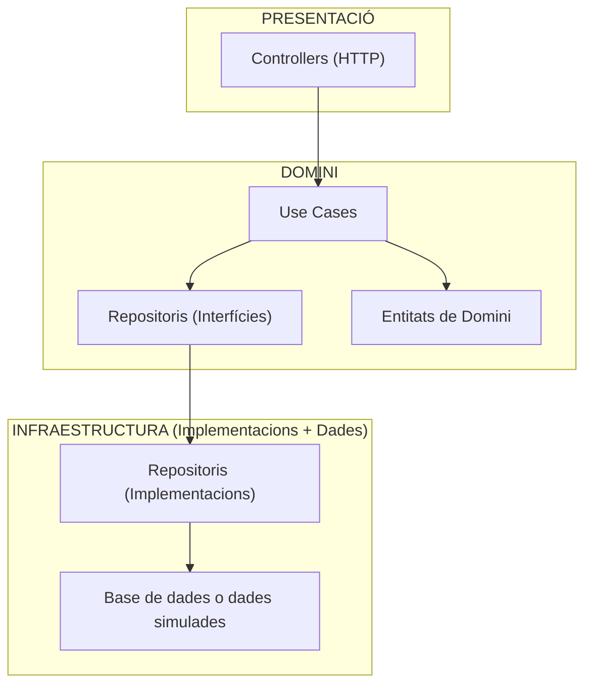
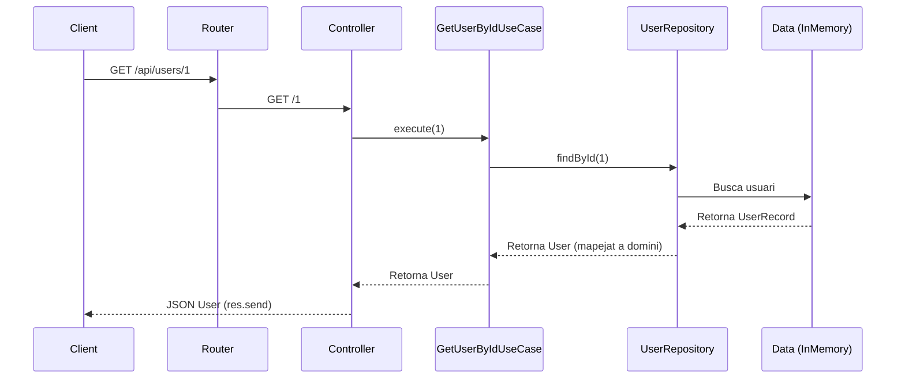

# Creació d'un backend senzill amb arquitectura CLEAN

En aquest repositori anem a veure la implementació d'un backend seguint una arquitectura en capes basada en els principis de *Clean Architecture*, amb l'objectiu principal de separar clarament responsabilitats i facilitar tant el manteniment com l'escalabilitat.

## L'arquitectura CLEAN

A grans trets, les principals capes en què treballàvem amb l'arquitectura CLEAN consistien en:

* **Capa de Domini (Domain)**: Amb les entitats principals i la lògica de negoci. Aquesta capa es componia de:

    * ***Entitats (Entities)***: Són les classes que representen conceptes del domini (Comarca, Provincia, Producte, Usuari...).
    * ***Repositoris abstractes (Repository)***: Que defineixen la forma que tenim d'accedir a la capa de persistència, mitjançant classes abstractes o interfícies. Recordem que tota implementació concreta que es faça, haurà d'implementar el comportament definit en estos repositoris.
    
* **Capa d'Infraestructura**: Conté la implementació concreta per a l'obtenció de les dades, ja siga a partir d'una base de dades, una altra API externa, fitxers, etc.  Dins d'ella distingim:

    * ***Data Sources (fonts de dades)***: Que són les classes que fan ús de les APIs, base de dades o fitxers.
    * ***Mappers***: Es tracta de classes o funcions que transformen les dades de la representació que obtenim per part dels Data Sources en entitats del domini.
    * ***Implementació dels repositoris***: Són la implementació concreta del comportament definit en les classes abstractes del repositori, depenents, ara sí, de les fonts de dades.
* **Capa de presentació**: Conté les classes que *presenten* les dades, i fan ús del repositori per obtenir aquestes. En una aplicació client això serà generalment la interfície d'usuari, però al nostre cas, en el backend serà com oferim el servei HTTP a través de REST.

Amb aquesta aproximació aconseguim que:

* La **lògica de negoci** siga independent de qualsevol detall tecnològic.
* El **domini** siga estable i no depenga de frameworks o bases de dades.
* La **persistència** i el **framework web (Express)** siguen plug-and-play, és a dir, podrem **substituir una base de dades** o framework HTTP sense modificar el domini.

## Estructura de Carpetes

En principi, anem a estructura el backend en les següents carpetes:

```
src/
├── app
│   ├── data                # Dades simulades (només en aquest exemple)
│   ├── domain              # Nucli -> entitats, repositoris, casos d'ús
│   ├── http                # Adaptadors d'entrada -> controllers + routes
│   └── infrastructure      # Adaptadors d'eixida -> persistència + mappers
└── index.ts                # Punt d'entrada
```

Aquest arquitectura s'inspira en el patró *Ports i Adaptadors* o [*Arquitectura Hexagonal*](https://medium.com/@edusalguero/arquitectura-hexagonal-59834bb44b7f).

## Diagrama de blocs

L'arquitectura en general serà la segënt:




En aquest diagrama:

* La **capa de presentació** és directament l'aplicació Express, que gestiona les rutes i els **Controllers**.
  
  Els controllers s'encarreguen de:

  * Rebre la petició HTTP
  * Validar i extraure les dades necessàries
  * Invocar el cas d’ús corresponent
  * Retornar la resposta HTTP adequada

  **No** contenen lògica de negoci, ja que només coordinen el flux de dades.

  * Dins d'aquesta mateixa capa apareix un nou element important: els **Casos d'Ús** (*Use Cases*):

    > Els **Casos d’Ús** representen la lògica de negoci de l’aplicació, i responen a la pregunta: **què pot fer l’usuari amb el sistema?**
    >
    > Es tracta doncs de la implementació directa dels casos d’ús del diagrama UML: Representen les accions que el sistema permet i encapsulen la lògica de negoci que defineix com es duen a terme.

    Cada cas d’ús encapsula una acció completa del sistema (crear usuari, obtindre productes, buscar per ID, etc.).

    Són independents de:

    * Express
    * La base de dades
    * La interfície d’usuari

    Això fa que el domini siga **portable i testejable**.

  * En aquesta capa també es definixen els **Repositoris**, però només com a **interfícies**.
    Un repositori és una promesa del tipus de mètodes per accedir a dades (buscar per ID, guardar, llistar...).
    La capa de domini **no sap** com s’implementen: només espera que existisquen.

* La **capa d’infraestructura (Persistència)** és qui s'encarrega d'implementar realment les interfícies definides als repositoris.

  Ací és on decidim, per exemple, si guardem la informació en una base de dades, fem crides a una API o utilitzem dades en memòria (com en aquest exemple).

  El punt clau és que **aquesta capa pot canviar totalment** (SQLite, Mongo, API externa, fitxers, etc.) **sense modificar la lògica dels casos d’ús ni els controllers**, perquè el domini només depén de les interfícies.

### Arquitectura CLEAN Principis SOLID

Els [principis SOLID](https://joamuran.net/curs24_25/edd/u6/2.principis_solid/), definits per Robert C. Martin (conegut com *Uncle Bob*) són una sèrie de principis de disseny que ens ajuden a crear un programari més flexible i mantenible, i sín fonamentals en la programació orientada a objectes.

L'arquitectura CLEAN, ideada també per Robert C. Martin, aplica aquests principis a l'estrucutura global d'un projecte, separant clarament les responsabilitats entre capes i fent el codi més mantenible i testejable.

Veiem com s'aplica cada principi en aquesta arquitectura:

* **S: Principi de responsabilitat Única**: *Cada classe o mòdul ha de tindre només una raó per canviar.*. Al nostre projecte cada capa té una responsabilitat única i ben definida: Els *Controllers* gestionaran les peticions HTTP; els *Casos d'ús* contindran la lògica de domini per a una acció concreta; els *Repositori* definiran com accedim a les dades; i la *Capa de persistència* s'encarrega de la implementació dels repositoris.
* **O: Principi de Obert/Tancat**: *El codi ha d’estar obert a l’extensió, però tancat a la modificació.* En el nostre projecte es veu en què podem canviar l'origen de les dades (a una BD, altre repositori, etc.) sense tocar els casos d'ús. Per tant, estem *Afegint funcionalitat (obert a l'extensió) sense modificar codi existent (tancat a modificació)*.
* **L: Principi de Substitució de Liskov**: *Si una classe implementa una interfície, ha de poder substituir-se sense canviar el comportament del sistema.*. En el nostre cas, com que **els repositoris són interfícies**, qualsevol implementació es pot posar en lloc d’una altra sense trencar res.
* **I: Principi de Segregació d’Interfícies**: *Les interfícies han de ser menudes i específiques.* En el nostre cas, les interfícies per gestionar els repositoris només contindran el codi estrictament necessari per a la seua funcionalitat (observeu per exemple el codi de `IUserRepository` o `IProductRepository`)
* **D: Inversió de Dependències**: *La lògica de negoci no depén de detalls tècnics, sinó d’abstraccions.* En el nostre cas, els casos d’ús depenen de la **interfície** `IUserRepository`, no de la seua implementació, fent que l'aplicació resulte flexigle i testejable.

En ressum:

| Principi | Com s’aplica en el projecte                                           |
| -------- | --------------------------------------------------------------------- |
| **S**    | Cada capa i classe té una sola responsabilitat.                       |
| **O**    | Podem afegir noves implementacions sense modificar casos d’ús.        |
| **L**    | Qualsevol repositori pot substituir-ne un altre sense problemes.      |
| **I**    | Les interfícies són petites i específiques per a cada agregat.        |
| **D**    | Els casos d’ús depenen d’interfícies, no d’implementacions concretes. |

Aquest últim principi s'aplica a més seguint un patró d'*Inversió de dependències: *Els mòduls d'alt nivell (casos d'ús) no han de dependre dirctament de la implementació (classesc concretes), sinó d'abstraccions (interfícies o classes abstractes)*.

Amb això podem:

* Canviar la infraestructura sense tocar la lògica,
* Reemplaçar repositoris per altres (ex.: MySQL, MongoDB, API extern...) sense realitzar canvis a casos d'ús
* Facilitar el testing (mock repositoris, que és el que estem fent)

La injecció de dependències es veu quan, per exemple, el controlador rep casos d'ús i els casos d'ús reben repositoris a través del constructor.

## Seqüència d'una Petició HTTP

Veiem, a mode d'exemple com es produeix una petició, com puga ser: `GET /api/users/1`:



Veiem en detall, i basant-nos en el codi aquest funcionament:

* **Pas 1. El Client fa una petició HTTP**

    El client/usuari fa la petició (ja siga des del navegador o amb `curl`):

    ```
    GET http://localhost:3000/api/users
    ```

* **Pas 2. Express rep la petició i la passa pel Router**

    **index.ts**:

    ```ts
    import { app } from "./app/http/server";

    app.listen(3000, () => {
    console.log("Servidor escoltant en http://localhost:3000");
    });
    ```

    **server.ts**:

    ```ts
    import express from "express";
    import userRouter from "./routes/user.routes";

    export const app = express();
    app.use(express.json());

    // Ací associem la ruta /api/users amb el router d’usuari
    app.use("/api/users", userRouter);
    ```

    Per tant:

    * Express rep totes les peticions.
    * Si la ruta comença per `/api/users`, es delega la petició al `userRouter`.

* **Pas 3. El Router determina quina funció del controlador executar**

    Veiem el codi del Router per a la gestió de les peticions relacionades amb els usuaris.

    Observeu que a més del *Router*, anem a crear un objecte de tipus `UserController` (més avant vorem aquest constructor), i com fem ús dels seus mètodes.

    **user.routes.ts**:

    ```ts
    
    // Creem una instància de Router (component d'Express)
    const userRouter = Router();
    // I una instància del la classe Controlador
    const controller = new UserController(...);

    const userRouter = Router();
    // Definim les rutes dins aquest router i enllacem amb les
    // funcions corresponents del controlador.
    userRouter.post("/", controller.create);
    userRouter.get("/", controller.getAll);
    userRouter.get("/:id", controller.getById);

    export default userRouter;
    ```

    Amb això, quan arriba una petició:

    * `GET /api/users/`, s’executa el mètode del controlador `controller.getAll`.
    * `GET /api/users/:id`, s’executa el mètode del controlador `controller.getById`.
    * `POST /api/users/`, s’executa el mètode del controlador `controller.create`.

    Observeu que el que fem amb aquestes últimes línies de codi **no és una una invocació (no hi ha `()`)**, sinò que estem ***enllaçant*** les peticions a mètodes/middlewares definits al *Controller* (de fet, sovint podeu veure un `bind` aci). És a dir, preparem l'aplicació per a que *quan vinga una petició de tipus GET/POST a les rutes concretes, Express, sàpiga quin mètode ha d'invocar*.

* **Pas 4. El Controlador rep la petició i crida a un Cas d’Ús**

    Abans de veure el codi del controlador d'usuaris, anem a veure una miqueta més a fons la injecció de dependències.

    > [!NOTE] **Sobre la Injeccció de dependències**
    >
    > La *injecció de dependències* és una tècnica que ens permet separar les classes de la responsabilitat de construir o buscar els objectes que necessiten per funcionar.
    >
    > És a dir, en lloc de crear directament els objectes dins d’altres objectes (per exemple, que un controlador cree el repositori), és una altra part del sistema qui s’encarrega de proporcionar aquests objectes com a paràmetres. 
    > D’aquesta manera, cada classe només coneix les abstraccions amb què treballa (interfícies), i no les seues implementacions concretes. 
    >
    > Açò facilita canviar la manera d’obtindre les dades (des de memòria, des d’una base de dades, des d’una API externa...) sense modificar la lògica dels casos d’ús o dels controladors. També fa que el sistema siga molt més fàcil de provar, ja que en proves podem substituir repositoris reals per mocks o dades simulades (com és el cas d'aquest exemple).
    
    Veiem com es defineix ara el controlador, i com es fa ús en ell de la injecció de dependències:

    ```ts
    // src/app/http/controllers/user.controller.ts
    export class UserController {
    constructor(
        private createUserUseCase: CreateUserUseCase,
        private getUsersUseCase: GetUsersUseCase,
        private getUserByIdUseCase: GetUserByIdUseCase
    ) {}

    async create(req: Request, res: Response) {
        const { name, email } = req.body;
        const user = await this.createUserUseCase.execute({ name, email });
        return res.status(201).json(user);
    }
    }
    ```

    En aquest cas, el **UserController** no crea directament els casos d'ús, sinó que **els rep com a dependències al constructor**. Això permet:

    * Substituir fàcilment els casos d'ús en proves.
    * Evitar couplar el controlador amb la lògica de negoci.
    * Facilitar la reutilització.

    Si tornem al codi del Router, veurem com creem la instància de la implementació *concreta* del repositori (concretament `UserRepositoryInMemory`), i com *injectem* aquest repositori en la instanciació dels *Casos d'ús*:

    ```ts
    // Creem una implementació del repositori
    const repo = new UserRepositoryInMemory();

    // Creem el Controlador per als usuaris, proporcionant-li
    // instàncies dels casos d'ús, que al seu temps hem inicialitzat
    // amb el repositori (injecció de dependències)
    const controller = new UserController(
    new CreateUserUseCase(repo),
    new GetUsersUseCase(repo),
    new GetUserByIdUseCase(repo)
    );
    ```

    En aquest codi estem fent una *injecció de dependències manual*, de manera que proporcionem les dependències en el constructor. Observem que estem *encadenant* aquesta injecció: Els casos d'ús necessiten del repositori, i el controlador necessita els casos d'ús.

    I tot seguit, definim els components (mètodes) `create`, `getAll` i `getById`:

    ```dart
    create=async (req: Request, res: Response, next: NextFunction) => {
        try {
            const result = await this.createUser.execute(req.body);
            res.status(201).json(result);
        } catch (err) { next(err); }
    }

    getAll = async (req: Request, res: Response, next: NextFunction) => {
        try {
            res.json(await this.getUsers.execute());
        } catch (err) { next(err); }
    }

    getById = async (req: Request, res: Response, next: NextFunction) => {
        try {
            let number;
            if (req.params.id == null) number = "-1";
            else number = req.params.id;
            const user = await this.getUserById.execute(Number.parseInt(number));
            if (!user) return res.status(404).json({ message: "User not found" });
            res.json(user);
        } catch (err) { next(err); }
    }
    ```

    Com veiem, aci només agafem la informació de la petició, i *executem* el cas d'ús corresponent.
   
    > [!NOTE] **Sobre `this`, `bind` i Funcions Fletxa**
    >     
    > Cal tindre en compte que quan usem *Express*, els controladors es passen com a callbacks. Per tant, si escrivim:
    >
    > ```ts
    > userRouter.get("/", controller.getAll);
    > ```
    > 
    > La referència al `this` de la classe es perd, perquè Express executa `getAll` *sense saber quin és l'objecte controlador*. Açò provoca errors com:
    > 
    > ```
    > TypeError: Cannot read properties of undefined (reading 'getUsersUseCase')
    > ```
    > 
    > Per evitar-ho, podem:
    > 
    > 1) Usar `.bind(this)` en les rutes
    > 
    > ```ts
    > userRouter.get("/", controller.getAll.bind(controller));
    > ```
    > 
    > 2) O declarar els mètodes del controlador com a funcions fletxa
    > 
    > ```ts
    > class UserController {
    >  constructor(private getUsersUseCase: GetUsersUseCase) {}
    > 
    > getAll = async (req: Request, res: Response) => {
    >     const users = await this.getUsersUseCase.execute();
    >     return res.json(users);
    >     }
    > }
    > ```
    > 
    > Les funcions fletxa *no creen un nou `this`*, per tant conserven el context del controlador. Açò ens evita haver d'usar `.bind()`.
    >

    Observem docns que:

    1. El controlador **no fa la lògica** de demanar o crear usuaris, sinò que crida als casos d'ús.
    2. El controlador **no sap** com s’obtenen les dades, només sap que té un repositori.


* **Pas 5. El Cas d’Ús encapsula la lògica de negoci**

    Finalment, qui realitza l'acció és el cas d'ús en sí. Per exemple, el cas d'ús per buscar un usuari:

    ```ts
    import { IUserRepository } from "../../../domain/repositories/IUserRepository";

    export class GetUserByIdUseCase {
        constructor(private userRepo: IUserRepository) {}

        async execute(id: number) {
            return this.userRepo.findById(id);
        }
    }
    ```

    Aci és on s'aplica la lògica de negoci: "Per obtenir un usuari, el demanem al repositori", però no sap res sobre la implementació del repositori, ni si es basa en una base da dades, en memòria en un fitxer o en altra API. **No és responsabilitat seua**.

    **És important notar que el repositori amb el què creem el cas d'ús és de tipus `IUserRepository`, és a dir, la interfície/abstacció,**


* **Pas 6. La implementació concreta del repositori és el que sap accedir a les dades**

    Ara sí, la implementació concrete del repositori, com la classe `UserRepositoryInMemory` que implementa el repositori en memòria és ja qui implementa l'accés a les dades:


    **UserRepositoryInMemory.ts**:

    ```ts
    import { users } from "../../../app/data/dades";

    export class UserRepositoryInMemory {
    async findAll() {
        return users;
    }
    }
    ```

    Ací sí hi ha *coneixement concret* d'on estan les dades, en quina estructura i com s'hi accedeix.
